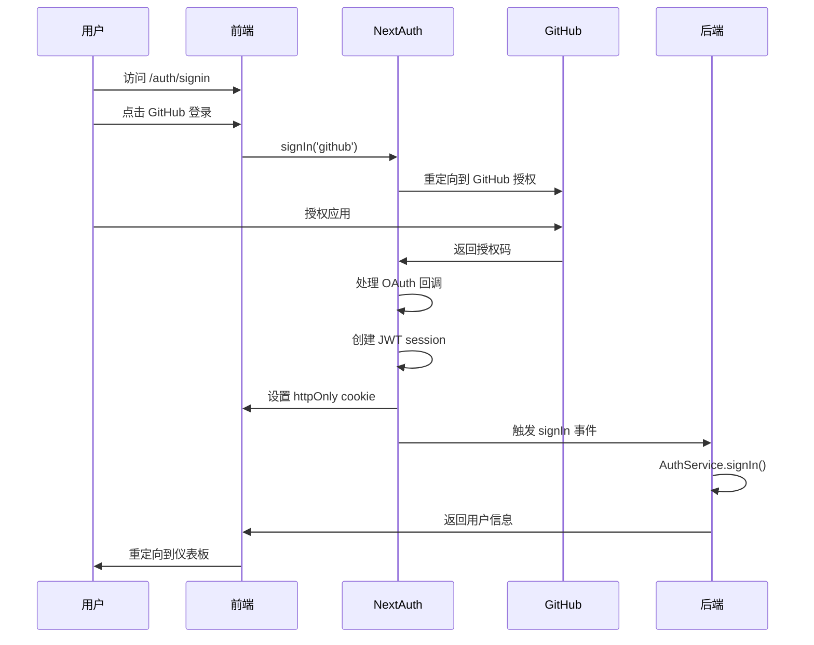
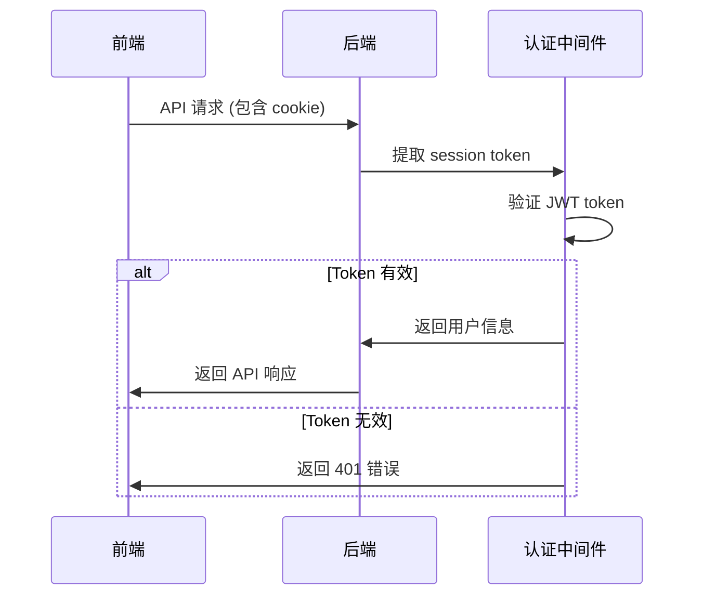
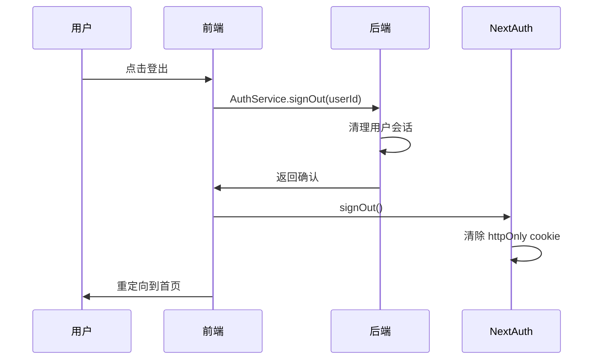

# Telos Web 认证流程文档

## 概述

Telos Web 采用现代化的认证架构，结合 NextAuth.js v5 和服务端 JWT 验证，提供安全、可靠的用户认证体验。

## 架构设计

### 核心组件

1. **NextAuth.js v5** - 前端认证框架
2. **httpOnly Cookies** - 安全的会话存储
3. **服务端 JWT 验证** - 后端 API 认证
4. **中间件路由保护** - 自动路由安全检查

### 安全特性

- ✅ **httpOnly Cookies** - 防止 XSS 攻击
- ✅ **CSRF 保护** - 自动 CSRF 令牌验证
- ✅ **安全重定向** - 验证所有重定向 URL
- ✅ **会话管理** - 自动刷新和过期处理
- ✅ **无状态设计** - 前端不直接处理 JWT

## 详细流程

### 1. 用户登录流程



#### 步骤详解

1. **用户发起登录**

   ```typescript
   // 用户点击登录按钮
   await signIn('github', { callbackUrl: '/dashboard' })
   ```

2. **OAuth 授权流程**
   - NextAuth 重定向到 GitHub 授权页面
   - 用户授权后返回应用
   - NextAuth 处理授权码并获取用户信息

3. **会话创建**

   ```typescript
   // NextAuth 自动创建 JWT session
   // 设置 httpOnly cookie
   cookies: {
     sessionToken: {
       name: 'next-auth.session-token',
       options: { httpOnly: true, secure: true }
     }
   }
   ```

4. **后端同步**

   ```typescript
   // NextAuth 事件回调
   events: {
     async signIn({ user, account }) {
       await AuthService.signIn({
         id: user.id,
         email: user.email,
         name: user.name,
         provider: account.provider
       })
     }
   }
   ```

### 2. API 请求认证流程



#### 请求处理

1. **自动 Cookie 发送**

   ```typescript
   // RequestService 自动包含 credentials
   const response = await fetch(url, {
     credentials: 'include', // 自动发送 cookie
     headers: { 'Content-Type': 'application/json' },
   })
   ```

2. **服务端验证**

   ```typescript
   // 后端从 cookie 中提取 token
   const sessionToken = req.cookies['next-auth.session-token']
   const user = await validateSessionToken(sessionToken)
   ```

3. **错误处理**

   ```typescript
   // 无效 token 返回 401
   if (!user) {
     return res.status(401).json({ error: 'Unauthorized' })
   }
   ```

### 3. 用户登出流程



#### 登出步骤

1. **前端登出**

   ```typescript
   const handleSignOut = async () => {
     // 先通知后端
     await AuthService.signOut(session.user.id)
     // 然后执行 NextAuth 登出
     await signOut({ redirect: false })
     router.push('/')
   }
   ```

2. **后端清理**

   ```typescript
   // 后端清理用户会话状态
   await AuthService.signOut(userId)
   ```

3. **Cookie 清理**

   ```typescript
   // NextAuth 自动清除 httpOnly cookie
   await signOut({ redirect: false })
   ```

## 路由保护

### 中间件保护

```typescript
// middleware.ts
export default async function middleware(request: NextRequest) {
  const session = await auth()

  if (isProtectedPath(pathname) && !session) {
    return NextResponse.redirect(new URL('/auth/signin', request.url))
  }
}
```

### 页面级保护

```typescript
// 受保护页面
export default async function DashboardPage() {
  const session = await auth()

  if (!session) {
    redirect('/auth/signin')
  }

  return <Dashboard user={session.user} />
}
```

### 客户端状态

```typescript
// 客户端组件
export function UserProfile() {
  const { data: session, status } = useSession()

  if (status === 'loading') return <Loading />
  if (!session) return <SignInPrompt />

  return <Profile user={session.user} />
}
```

## API 服务层

### AuthService

```typescript
export class AuthService {
  // 用户登录
  static async signIn(userData: SignInData): Promise<ApiResponse<AuthResponse>>

  // 用户登出
  static async signOut(userId: string): Promise<ApiResponse>

  // 同步用户信息
  static async syncUser(userData: UserData): Promise<ApiResponse<AuthResponse>>

  // 获取当前用户
  static async getCurrentUser(): Promise<ApiResponse<BackendUser>>

  // 更新用户信息
  static async updateUser(
    userId: string,
    userData: Partial<BackendUser>
  ): Promise<ApiResponse<BackendUser>>
}
```

### RequestService

```typescript
export class RequestService {
  // 自动包含 credentials 的请求方法
  async get<T>(endpoint: string): Promise<T>
  async post<T>(endpoint: string, data?: any): Promise<T>
  async put<T>(endpoint: string, data?: any): Promise<T>
  async delete<T>(endpoint: string): Promise<T>
}
```

## 配置说明

### NextAuth 配置

```typescript
const authConfig: NextAuthConfig = {
  providers: [GitHub({...})],
  session: { strategy: 'jwt' },
  cookies: {
    sessionToken: {
      name: process.env.NODE_ENV === 'production'
        ? '__Secure-next-auth.session-token'
        : 'next-auth.session-token',
      options: { httpOnly: true, secure: true }
    }
  },
  events: {
    async signIn({ user, account }) {
      await AuthService.signIn({...})
    }
  }
}
```

### 环境变量

```bash
# 必需
AUTH_SECRET=your-secret-key
NEXTAUTH_URL=http://localhost:8800
GITHUB_CLIENT_ID=your-github-client-id
GITHUB_CLIENT_SECRET=your-github-client-secret

# 可选
NEXT_PUBLIC_API_URL=http://localhost:8890
```

## 故障排除

### 常见问题

1. **登录后立即登出**
   - 检查 `AUTH_SECRET` 是否正确设置
   - 确认 `NEXTAUTH_URL` 与访问 URL 匹配
   - 查看浏览器控制台错误

2. **API 请求返回 401**
   - 检查 cookie 是否正确发送
   - 确认后端服务正在运行
   - 验证 session token 格式

3. **路由重定向循环**
   - 检查中间件配置
   - 确认受保护路径定义正确
   - 查看 NextAuth 调试日志

### 调试技巧

1. **启用调试模式**

   ```typescript
   debug: process.env.NODE_ENV === 'development'
   ```

2. **检查 Cookie**

   ```javascript
   // 浏览器控制台
   document.cookie // 查看所有 cookies
   ```

3. **网络请求调试**
   - 打开浏览器开发者工具
   - 查看 Network 标签页
   - 检查请求是否包含 cookie

4. **服务端日志**

   ```bash
   # 查看 NextAuth 日志
   npm run dev
   ```

## 最佳实践

1. **安全性**
   - 始终使用 `httpOnly` cookies
   - 在生产环境启用 `secure` 标志
   - 定期轮换 `AUTH_SECRET`

2. **性能**
   - 使用 `useSession()` 缓存用户状态
   - 避免在客户端组件中调用 `auth()`
   - 合理设置会话过期时间

3. **用户体验**
   - 提供清晰的登录/登出反馈
   - 实现优雅的错误处理
   - 支持记住用户登录状态

4. **开发体验**
   - 使用 TypeScript 确保类型安全
   - 编写单元测试覆盖认证逻辑
   - 保持代码结构清晰
