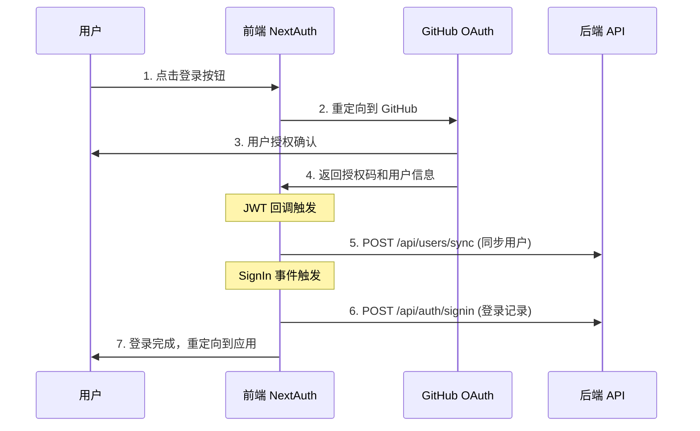
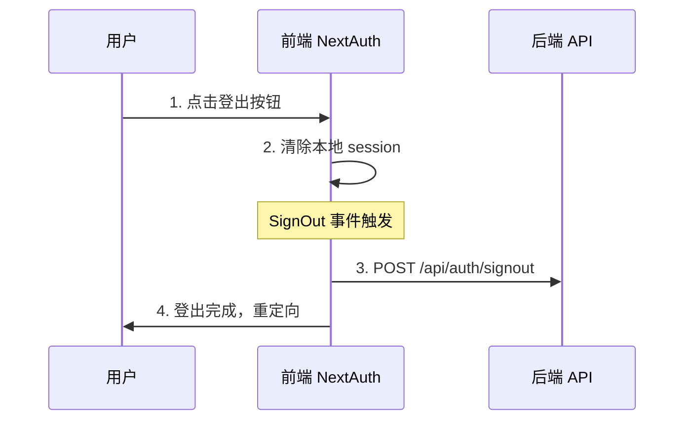

# Telos 认证系统集成文档

## 📋 概述

Telos 项目采用现代化的认证架构，结合 NextAuth.js 和后端微服务，实现了完整的用户认证和状态同步系统。本文档详细说明了认证系统的工作原理、集成方式和最佳实践。

## 🏗️ 系统架构

```
┌─────────────────┐    ┌──────────────────┐    ┌─────────────────┐
│   前端 (Next.js) │◄──►│  GitHub OAuth    │    │  后端微服务      │
│   + NextAuth.js │    │                  │    │  (Go Services)  │
└─────────────────┘    └──────────────────┘    └─────────────────┘
         │                                               ▲
         └───────────────────────────────────────────────┘
                    API 调用同步用户状态
```

### 核心组件

- **NextAuth.js**: 前端认证框架，处理 OAuth 流程
- **GitHub OAuth**: 第三方认证提供者
- **JWT Strategy**: 无服务器友好的会话管理
- **API Client**: 统一的后端接口调用
- **Go 微服务**: 后端认证和用户管理服务

## 🔄 完整认证流程

### 1. 用户登录流程



**详细步骤说明**:

1. **OAuth 认证**: 用户通过 GitHub OAuth 完成身份验证
2. **JWT 回调**:
   - 保存用户信息到 JWT token
   - 调用 `/api/users/sync` 确保用户在后端存在
3. **Session 构建**: 将 JWT 信息传递给客户端 session
4. **登录事件**: 调用 `/api/auth/signin` 记录登录行为
5. **完成认证**: 用户获得完整的认证状态

### 2. 用户登出流程



### 3. 路由保护机制

```typescript
// 受保护的路由列表
const protectedRoutes = [
  '/dashboard', // 仪表板
  '/profile', // 用户资料
  '/workflows', // 工作流管理
  '/settings', // 系统设置
]

// 中间件自动检查认证状态
const isLoggedIn = !!auth?.user
const needsAuth = protectedRoutes.some(route =>
  nextUrl.pathname.includes(route)
)
```

## 🔧 技术实现

### 1. NextAuth 配置 (`src/auth.ts`)

```typescript
const authConfig: NextAuthConfig = {
  providers: [
    GitHub({
      clientId: process.env.GITHUB_CLIENT_ID!,
      clientSecret: process.env.GITHUB_CLIENT_SECRET!,
    })
  ],
  session: {
    strategy: 'jwt',           // JWT 策略
    maxAge: 30 * 24 * 60 * 60, // 30 天有效期
    updateAge: 24 * 60 * 60,   // 24 小时更新
  },
  callbacks: {
    // JWT 回调 - 处理用户信息和后端同步
    async jwt({ token, user, account }) { ... },

    // Session 回调 - 构建客户端会话
    async session({ session, token }) { ... },

    // 授权回调 - 路由保护
    async authorized({ auth, request }) { ... }
  },
  events: {
    // 登录事件 - 调用后端登录接口
    async signIn({ user, account }) { ... },

    // 登出事件 - 调用后端登出接口
    async signOut(message) { ... }
  }
}
```

### 2. API 客户端 (`src/lib/api-client.ts`)

```typescript
class ApiClient {
  // 用户登录接口
  async signIn(userData: SignInData): Promise<ApiResponse<AuthResponse>>

  // 用户登出接口
  async signOut(userId: string): Promise<ApiResponse>

  // 用户信息同步接口
  async syncUser(userData: UserData): Promise<ApiResponse<AuthResponse>>
}
```

### 3. 类型定义 (`src/types/auth.ts`)

```typescript
// 基础用户数据
interface UserData {
  id: string
  email?: string | null
  name?: string | null
  image?: string | null
  provider: string
}

// 登录数据 (包含访问令牌)
interface SignInData extends UserData {
  accessToken?: string
}

// 统一 API 响应格式
interface ApiResponse<T = any> {
  success: boolean
  data?: T
  message?: string
  error?: string
}
```

## 🌐 后端 API 接口规范

### 1. 用户信息同步接口

**接口**: `POST /api/users/sync`

**用途**: 在用户首次登录时同步用户信息到后端数据库

**请求体**:

```json
{
  "id": "github_user_123",
  "email": "user@example.com",
  "name": "张三",
  "image": "https://avatars.githubusercontent.com/u/123",
  "provider": "github"
}
```

**响应示例**:

```json
{
  "success": true,
  "data": {
    "user": {
      "id": "github_user_123",
      "email": "user@example.com",
      "name": "张三",
      "avatar": "https://avatars.githubusercontent.com/u/123",
      "provider": "github",
      "isActive": true,
      "createdAt": "2024-01-01T00:00:00Z",
      "updatedAt": "2024-01-01T00:00:00Z"
    }
  },
  "message": "用户信息同步成功"
}
```

### 2. 用户登录接口

**接口**: `POST /api/auth/signin`

**用途**: 记录用户登录行为，更新最后登录时间

**请求体**:

```json
{
  "id": "github_user_123",
  "email": "user@example.com",
  "name": "张三",
  "image": "https://avatars.githubusercontent.com/u/123",
  "provider": "github",
  "accessToken": "gho_xxxxxxxxxxxx"
}
```

**响应示例**:

```json
{
  "success": true,
  "data": {
    "user": {
      "id": "github_user_123",
      "email": "user@example.com",
      "name": "张三",
      "avatar": "https://avatars.githubusercontent.com/u/123",
      "provider": "github",
      "isActive": true,
      "lastLoginAt": "2024-01-01T12:00:00Z",
      "createdAt": "2024-01-01T00:00:00Z",
      "updatedAt": "2024-01-01T12:00:00Z"
    },
    "token": "jwt_token_here",
    "refreshToken": "refresh_token_here"
  },
  "message": "登录成功"
}
```

### 3. 用户登出接口

**接口**: `POST /api/auth/signout`

**用途**: 记录用户登出行为，清理服务端会话

**请求体**:

```json
{
  "userId": "github_user_123"
}
```

**响应示例**:

```json
{
  "success": true,
  "message": "登出成功"
}
```

## ⚙️ 环境配置

### 前端环境变量 (`.env.local`)

```env
# NextAuth 配置
AUTH_SECRET="P7Jnw8qrTDrbA9w200CYEGO9SrvN0DoO+ssJPI4h5UI="
NEXTAUTH_URL="http://localhost:8800"

# GitHub OAuth 配置
GITHUB_CLIENT_ID="Ov23ct6a75nxrAI9WK8e"
GITHUB_CLIENT_SECRET="2e39aedd51666636515e20a4550efc0fc56b779a"

# API 配置
NEXT_PUBLIC_API_URL="http://localhost:8890"

# 应用配置
NEXT_PUBLIC_DOMAIN="localhost:8800"
NEXT_PUBLIC_NODE_ENV="development"
```

### GitHub OAuth 应用设置

1. 访问 [GitHub Developer Settings](https://github.com/settings/applications/new)
2. 创建新的 OAuth App
3. 配置回调 URL: `http://localhost:8800/api/auth/callback/github`
4. 获取 Client ID 和 Client Secret

## 🛡️ 安全特性

### 1. 错误处理策略

```typescript
try {
  await apiClient.signIn(userData)
  console.log('后端登录接口调用成功')
} catch (error) {
  console.error('后端登录接口调用失败:', error)
  // 关键：不抛出错误，避免阻止用户登录
}
```

**设计原则**:

- 后端 API 调用失败不影响前端登录流程
- 优雅降级，确保用户体验
- 详细的错误日志，便于问题排查

### 2. 会话管理

- **JWT 策略**: 无状态，适合微服务架构
- **自动刷新**: 24小时更新一次，保持会话活跃
- **安全过期**: 30天绝对过期时间
- **路由保护**: 中间件自动检查受保护路由

### 3. 类型安全

- 完整的 TypeScript 类型定义
- NextAuth 类型扩展
- API 请求/响应类型检查
- 编译时错误检测

## 🚀 使用示例

### 1. 在组件中使用认证

```typescript
import { useSession, signIn, signOut } from 'next-auth/react'

export function AuthButton() {
  const { data: session, status } = useSession()

  if (status === 'loading') return <p>加载中...</p>

  if (session) {
    return (
      <div>
        <p>欢迎, {session.user?.name}</p>
        <button onClick={() => signOut()}>登出</button>
      </div>
    )
  }

  return (
    <button onClick={() => signIn('github')}>
      使用 GitHub 登录
    </button>
  )
}
```

### 2. 服务端认证检查

```typescript
import { auth } from '@/auth'

export default async function ProtectedPage() {
  const session = await auth()

  if (!session) {
    redirect('/auth/signin')
  }

  return <div>受保护的内容</div>
}
```

### 3. API 路由保护

```typescript
import { auth } from '@/auth'
import { NextRequest } from 'next/server'

export async function GET(request: NextRequest) {
  const session = await auth()

  if (!session) {
    return Response.json({ error: '未授权' }, { status: 401 })
  }

  // 处理已认证的请求
  return Response.json({ data: 'protected data' })
}
```

## 🔍 调试和监控

### 1. 开发环境调试

```typescript
// auth.ts 中启用调试模式
debug: process.env.NODE_ENV === 'development'
```

### 2. 日志监控

```typescript
// 登录成功日志
console.log('用户登录:', {
  user: user.email,
  provider: account?.provider,
  timestamp: new Date().toISOString(),
})

// 后端 API 调用日志
console.log('后端登录接口调用成功')
console.error('后端登录接口调用失败:', error)
```

### 3. 错误追踪

- 前端错误不会阻断认证流程
- 详细的错误信息记录到控制台
- 区分前端认证错误和后端 API 错误

## 📝 最佳实践

### 1. 开发建议

- **渐进式集成**: 先确保前端认证工作，再集成后端 API
- **错误容错**: 后端服务不可用时，前端认证仍应正常工作
- **类型优先**: 使用 TypeScript 确保类型安全
- **环境隔离**: 开发、测试、生产环境分别配置

### 2. 安全建议

- **密钥管理**: 使用环境变量管理敏感信息
- **HTTPS**: 生产环境必须使用 HTTPS
- **令牌过期**: 合理设置会话过期时间
- **权限控制**: 实现细粒度的权限管理

### 3. 性能优化

- **JWT 策略**: 减少数据库查询
- **会话缓存**: 合理使用会话缓存
- **异步处理**: 后端 API 调用不阻塞用户操作
- **错误重试**: 实现合理的重试机制

## 🔧 故障排除

### 常见问题

1. **GitHub OAuth 配置错误**
   - 检查 Client ID 和 Secret
   - 确认回调 URL 配置正确

2. **后端 API 调用失败**
   - 检查 API 地址配置
   - 确认后端服务运行状态
   - 查看网络连接和防火墙设置

3. **会话状态异常**
   - 清除浏览器缓存和 Cookie
   - 检查 AUTH_SECRET 配置
   - 确认时区和时间同步

4. **类型错误**
   - 更新 TypeScript 类型定义
   - 检查 NextAuth 版本兼容性
   - 重新安装依赖包

### 调试步骤

1. 检查环境变量配置
2. 查看浏览器开发者工具控制台
3. 检查网络请求和响应
4. 确认后端服务日志
5. 验证数据库连接和数据

## 📚 相关文档

- [NextAuth.js 官方文档](https://next-auth.js.org/)
- [GitHub OAuth 应用设置](https://docs.github.com/en/developers/apps/building-oauth-apps)
- [JWT 最佳实践](https://tools.ietf.org/html/rfc7519)
- [Next.js 中间件文档](https://nextjs.org/docs/app/building-your-application/routing/middleware)

---

**更新日期**: 2025.7.29
**版本**: v1.0.0
**维护者**: Telos 开发团队
